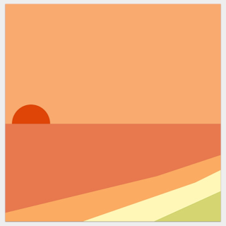
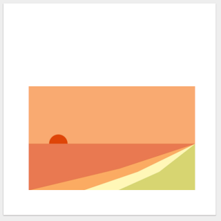

# Albelli test

**Please read this entire document carefully.**

This repository contains a basic setup for a JavaScript project. 
See "_System requirements_" below to get up  and running!
The "_Project outline_" section walks you through a basic rundown of the structure.

## The test

You will be working in a company where our customers purchase printed products.
As such your expertise should not be restricted to developing applications,
but also extend to understand the requirements
of print and how to translate between the app and the print world and vice versa.

### Goal

You should write a very simple application where there are two scenarios:

##### Scenario 1.

* The application has a fixed size canvas on which the image will be rendered
* User can select a photo file from his/her device and import it into the application
  * The photo must fill entirely the fixed size canvas.
    If the application have a landscape canvas and a portrait image is uploaded,
    then only the middle of the photo is drawn on the canvas
* The user can position (move) this photo on a canvas. **Important**: The photo should always cover the entire canvas, there should be no white space around the image..
  * Correct:

  

  * Not correct:

  

* User can hit the export button which will generate the print description as described
  [below](https://github.com/albumprinter/software-engineer-js-test/tree/photo-editor#print-description)
  These instructions should be stored locally as a JSON file.

##### Scenario 2.

* The user can hit an import button which loads a previously saved JSON description
* Upon loading, the application should show a canvas that contains the photo
* Photo is scaled and positioned as expected according to the loaded print instructions
* The user should be able to further modify the image

#### Deliverables

Out of the box, the application already provides you some code to load
and validate image files from your computer. You can take some inspiration
here, or if you don't like the design approach of that code, feel free
to show what you think is the "right approach" to code this application.
Don't write code that just "get's the job done", write it as if was an
application that you would have to maintain for years to come ;)

It is by no means necessary to make this application look attractive or
to spend a lot of time in providing the best interaction with the photo.
If you need to add buttons to “_move photo left_”, "_move photo right_" is enough. It is about the
_design of your code_, NOT the design of the application interface!

It is more important to show how you write (in your eyes) a maintainable
application. Be prepared to explain the steps you took in a review of this test.

It is preferred to use **React** and **TypeScript**.

Don't forget to cover development with **tests**.

#### Product canvas properties

At Albelli, we define the dimensions of our printed products in inches.
For this application we will name the product “Canvas” (a single printable surface).
This Canvas is a rectangle of 15” x 10” in size.

A photo must always fill the full surface of the canvas (in other words:
a photo must cover an area equal to or larger than 15” in width or 10” in height).

A photo has the following properties: width, height, x and y (once more
all in inches). X and Y describe the coordinates of the photo relative
to the top-left position of its canvas.

#### Print description

The print description you will generate (in scenario #1 of your application) can be in JSON format.
Example:

    {
        "canvas": {
            "width": 15
            "height": 10,
            "photo" : {
                "id": "string",
                "src": "base64-encoded-image",
                "width": 20,
                "height": 20,
                "x": -2.5,
                "y": -5
            }
        }
    }

#### Rules

Once you receive this test by e-mail please fork this repository to your own GitHub account.

Your application should run on the latest public version of Google Chrome.
You don't have to worry about making your code work on any other browser, as
such you are free to use anything that is supported by Chrome and not worry
about cross-browser implementations.

## Project outline

The entry point for your React application is _./app/index.html_. 

Parcel is used to bundle tha application.
It has a development server built in, which will automatically rebuild the application as you make changes.

## Tests

Jest is packaged in this application for writing and running tests, but feel free to use any framework/runner of your choice
Spec file _./app/components/photo-editor/index.spec.ts_

## System requirements

In order to build the project you will need [Node.js](https://nodejs.org/en/).

In the root of this repository, you can resolve all these dependencies via
the command line using:

    yarn install
    
You can now start developing the application using Parcel by typing:

    yarn start

**We wish you success with your test!**
